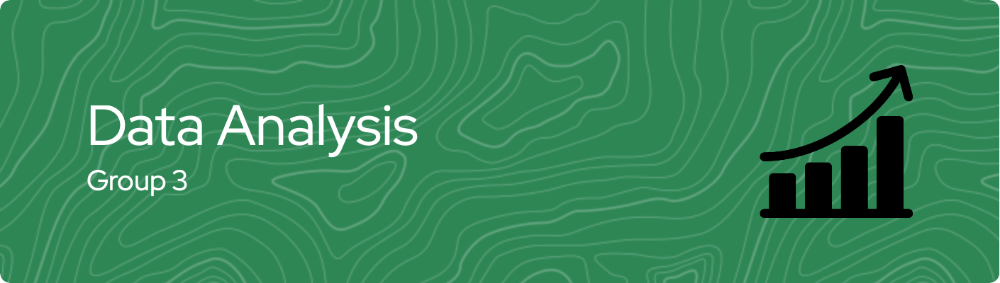

## Summary
This group project explores how to effectively convert casual riders into subscribers of Divvy Cyclistic bike-sharing service by identifying customer behaviors. To do this, we raised three main questions followed by the findings and actionable recommendations. 

| Question | Key Insight | Recommendation |
| --- | --- | --- |
| How are casual riders and subscribers different? | Casual riders and subscribers reveal clear distinctions during Q3 | Implement a targeted promotional campaign specifically designed to encourage casual riders to convert into subscribers |
| Why would casual riders buy membership | Pricing analysis underscores attractiveness of annual membership option | Promote annual membership benefits by launching a targeted markerting campaign highlighting the advantages and budget-friendly plan to convert casual riders |
| How digital media could affect their marketing tactics? | Customer type, time, and location can be used for implementing cost-efficient marketing approach to reach potential subscribers | Utilize customer segmentation based on the features to create personalized advertizing campaigns. |


## How to Reproduce
While this project uses files downloaded from this [URL](https://divvy-tripdata.s3.amazonaws.com/index.html), the files can be directly accessed by running the following script. But please note that the file sizes are quite big so the running time will take a while. 

```python
import pandas as pd
import requests
from zipfile import ZipFile
from io import BytesIO

file_names = [
    '202307-divvy-tripdata.zip',
    '202308-divvy-tripdata.zip',
    '202309-divvy-tripdata.zip'
    ]

base_url = 'https://divvy-tripdata.s3.amazonaws.com/'

dfs = []
for file_name in file_names:
    url = url + file_name
    response = requests.get(url)
    
    with ZipFile(BytesIO(response.content)) as z:
        csv_file = z.namelist()[0]
        df = pd.read_csv(z.open(csv_file))
        dfs.append(df)

combined_df = pd.concat(dfs, ignore_index=True)

combined_df.head()
```

## Collaboration
This project was done in group with the following members. Feel free to contact us for a collaboration!
1. [Kristian Brilyawan](https://github.com/Brilyawan)
2. [Farhan Trinanda Putra](https://github.com/FarhanTrinanda)
3. [Muhammad Tofik Hidayat](github.com/muhammadtofikhidayat)
4. [Ridho Aryawan](https://github.com/ridhoaryawann)
5. [Adelia Januarto](https://github.com/LingAdeu)
